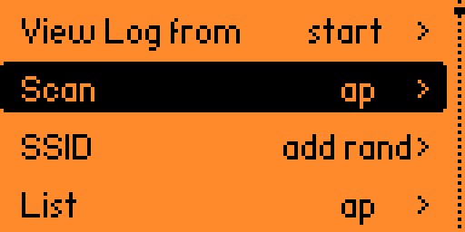
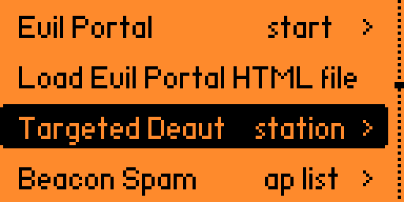
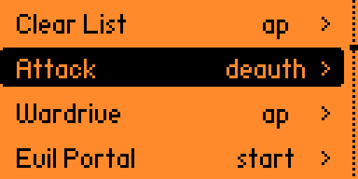
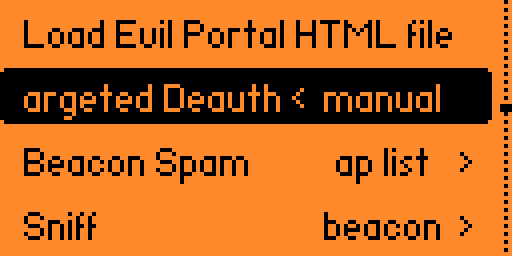

# 🧪 WiFiDeauthLab

Laboratorio experimental diseñado para explorar y documentar ataques de **desautenticación (deauth)** en redes WiFi dentro de un entorno controlado y seguro. Este proyecto tiene como objetivo proporcionar recursos **educativos** para entender cómo funcionan estos ataques, cómo configurarlos en un entorno seguro, y cómo mitigar sus efectos en redes reales, utilizando la herramienta [**ESP32Marauder**](https://github.com/justcallmekoko/ESP32Marauder) y **Flipper Zero**.

> [!WARNING]
> Este repositorio está destinado exclusivamente a **fines educativos y de investigación** en ciberseguridad. El uso indebido de esta información en redes no autorizadas ***es ilegal y está estrictamente prohibido en multitud de paises***.

## Hardware utilizado

- **Flipper Zero**: Dispositivo multifuncional utilizado para auditorías de seguridad en diversos protocolos, incluido Wi-Fi.

- **ESP32-S2**: WiFi Devboard for Flipper Zero (basada en ESP32-S2) utilizada para ejecutar y analizar ataques de deauth.

<div style="margin-top: 20px; margin-bottom: 20px;" align="center">
    
</div>

> Tienes más información sobre estos dispositivos al final de esta documentación.

## Configuración inicial

### Preparación del Flipper Zero
Para comenzar, debemos instalar en nuestro Flipper Zero la aplicación [**[ESP32] WiFi Marauder**](https://github.com/0xchocolate/flipperzero-wifi-marauder). Si bien este método es funcional, la documentación oficial de ESP32 Marauder recomienda instalar un custom firmware para aprovechar al máximo esta herramienta en el Flipper Zero.

En este laboratorio utilizaremos el firmware personalizado [**Momentum**](https://github.com/Next-Flip/Momentum-Firmware), el cual ya viene precompilado con la aplicación [WiFi Marauder para Flipper Zero](https://github.com/0xchocolate/flipperzero-wifi-marauder). Puedes instalarlo de manera sencilla usando su [instalador web](https://momentum-fw.dev/update/).

<div style="margin-top: 20px; margin-bottom: 20px;" align="center">
    
</div>

Con esto finalizamos la configuración del Flipper Zero y pasamos a preparar la placa de desarrollo.


### Preparación de la placa de desarrollo

Según la documentación oficial de ESP32 Marauder, existen dos métodos para configurar la placa de desarrollo:  
- **Método supervisado** (Zero Config): recomendado para principiantes o quienes buscan una configuración rápida y sencilla.  
- **Método avanzado**: diseñado para usuarios que deseen comprender el funcionamiento interno del proceso.

En nuestro caso, seguiremos el método **supervisado** (identificado como "pastilla azul" 😁 en la documentación).

1. **Flasheo de la placa:**  

   Usaremos el proyecto [FZ Marauder Flasher](https://github.com/UberGuidoZ/Flipper/tree/main/Wifi_DevBoard/FZ_Marauder_Flasher), que ofrece un enfoque simplificado para flashear la placa de desarrollo. Aunque existe un flasher online para este propósito, en mis pruebas no funcionó correctamente para modificar la placa.

   Antes de conectar la placa a nuestro PC por el puerto USB Type-C, debemos **mantener pulsado el botón boot** de la misma. Manteniendolo pulsado es cuando lo enchufaremos al PC.

2. **Ejecutar el script Flash-v2.8.bat:**

    Al ejecutar el script, seleccionamos la `opción 1`. Esta opción flashea automáticamente la placa sin necesidad de configuraciones adicionales.

Si todo se realizó correctamente, tu placa de desarrollo estará configurada y lista para usar.

### Escaneo de Puntos de acceso

Para materializar toda la configuración anterior, realizaremos un escaneo de puntos de acceso WiFi disponibles. Para ello, navegaremos por las opciones de menú del Flipper Zero, con la dev board conectada: `Apps > GPIO > ESP > [ESP32] WiFi Marauder`. 

Simplemente seleccionaremos la opción **Scan** con el parámetro `ap`. A continuación, se imprimirá en pantalla una lista de todos los puntos de acceso en nuestro entorno. 

Si todo ha ido bien, ya tendremos nuestro instrumental listo para continuar con el laboratorio.

<div style="margin-top: 20px; margin-bottom: 20px;" align="center">
    
</div>

## Deauth WiFi

Existen 3 modalidades: **Targeted**, **Flood** y **Manual**. La modalidad Targeted se centra en desconectar dispositivos específicos, Flood afecta a todos los dispositivos de una red, y Manual permite configuraciones personalizadas para mayor control.

Para comprender cómo es posible llevar a cabo este ataque, te recomiendo leer mis notas [Entendiendo los Ataques de Desautenticación WiFi](/wifi_deauth_lore.md).

### Targeted mode

La modalidad **Targeted** consiste en enviar paquetes de desautenticación dirigidos únicamente a dispositivos específicos conectados a un punto de acceso. Esto permite desconectar un cliente específico en lugar de afectar a todos los usuarios de la red. A continuación, detallamos las etapas de esta modalidad de ataque.

> Marauder modificará los 🚨LEDs de la dev board según la acción que se está ejecutando. El LED 🔵 azul indica que está escaneando y el 🔴 rojo que está atacando.

Dentro de la aplicación **[ESP32] WiFi Marauder**:

1. Escanear el listado de puntos de acceso disponibles en la zona.
    - Opción de menú: `Scan ap`.
    - Dejamos que el escaneo se ejecute durante unos instantes (30s).
    - Presionamos el botón `back` de nuestro Flipper.

2. Comprobar el listado de puntos de acceso recopilados.
    - Opción de menú: `List ap`.
    - Apuntamos el índice del punto de acceso objetivo.
    - Presionamos el botón `back` de nuestro Flipper.

3. Seleccionar el punto de acceso objetivo.
    - Opción de menú: `Select ap`.
    - Completamos el script con el índice apuntado en el paso anterior.
        ```bash
        $ select -a <index-ap>
        ```
    - Presionamos el botón `back` de nuestro Flipper.

4. Comprobar que el punto de acceso se ha seleccionado.
    - Opción de menú: `List ap`.
    - El punto de acceso objetivo debe aparecer con la etiqueta `(selected)`.
    - Presionamos el botón `back` de nuestro Flipper.

5. Escanear dispositivos (stations) conectados a ese punto de acceso.
    - Opción de menú: `Scan station`.
    - Esta acción toma más tiempo (al menos en mi caso) que el escaneo de APs.
    - Presionamos el botón `back` de nuestro Flipper.

6. Comprobar el listado de dispositivos recopilados.
    - Opción de menú: `List station`.
    - Aparecen agrupados por APs. Debemos buscar nuestro punto de acceso objetivo e identificar el dispositivo objetivo entre los que están conectados a él.
    - Apuntamos el índice del dispositivo (station) objetivo.
    - Presionamos el botón `back` de nuestro Flipper.

7. Seleccionar el dispositivo objetivo.
    - Opción de menú: `Select station`.
    - Completamos el script con el índice apuntado en el paso anterior.
        ```bash
        $ select -c <index-ap>
        ```
    - Presionamos el botón `back` de nuestro Flipper.

8. Comprobar que tenemos seleccionado el punto de acceso y el dispositivo objetivo.
    - Opción de menú: `List ap`.
    - Comprobamos que nuestro AP tiene la etiqueta `(selected)`.
    - Opción de menú: `List station`.
    - Comprobamos que nuestra Station tiene la etiqueta `(selected)`.

9. Si todo ha ido bien, podemos proceder a la ejecución del ataque.
    - Opción de menú: `Targeted deauth station`.
    - El LED 🚨 de nuestra dev board cambiará a rojo, indicando que el ataque está en curso. En este momento, **el dispositivo objetivo perderá la conexión** con la red WiFi proporcionada por el AP objetivo. Si intentamos reconectar el dispositivo a la red WiFi, veremos que **no es posible hasta que detengamos el ataque** desde nuestro Flipper.

<div style="margin-top: 20px; margin-bottom: 20px;" align="center">
    
</div>

### Flood mode

El modo **Flood** (desautenticación masiva) envía una gran cantidad de paquetes de desautenticación dirigidos a todos los dispositivos conectados a un punto de acceso WiFi (AP). A diferencia del **Targeted**, este método es mucho más agresivo, ya que **interrumpe simultáneamente la conexión de todos los dispositivos** en la red, causando una desconexión generalizada.

El procedimiento es bastante similar al modo **Targeted**, tanto que hasta el punto 4 son idénticos.

1. Seleccionamos el AP objetivo.
    - Realizar los pasos del `1` al `4` del modo **Targeted**

2. Si todo ha ido bien, podemos proceder a la ejecución del ataque.
    - Opción de menú: `Attack deauth`.
    - El LED 🚨 de nuestra dev board cambiará a rojo, indicando que el ataque está en curso. En este momento, **todos los dispositivos perderán la conexión** con la red WiFi proporcionada por el AP objetivo. Si intentamos reconectar alguno de los dispositivos a la red, veremos que **no es posible hasta que detengamos el ataque** desde nuestro Flipper.

<div style="margin-top: 20px; margin-bottom: 20px;" align="center">
    
</div>

### Manual mode

Es el método ideal para pruebas en escenarios específicos o para objetivos fuera del alcance del escáner de redes. No requiere realizar un escaneo previo de puntos de acceso (AP) o dispositivos (Stations), pero como contrapartida, es necesario conocer de antemano la dirección MAC del origen (AP) y la del destino (Station).

El procedimiento desde nuestro Flipper Zero para perpetrar el ataque es quizas el más sencillo de los tres:

1. Ejecutar el ataque manual proporcionando la direción MAC de origen y destino.

    - Opción de menú: `Targeted deauth manual`.
    - Insertamos la dirección MAC de origen (AP)
    - Insertamos la dirección MAC de destino (Station)
    - El LED 🚨 de nuestra dev board cambiará a rojo, indicando que el ataque está en curso. En este momento, **el dispositivo especificado perderá la conexión** con la red WiFi proporcionada por el AP objetivo. Si intentamos reconectar de nuevo el dispositivo a la red, veremos que **no es posible hasta que detengamos el ataque** desde nuestro Flipper.

<div style="margin-top: 20px; margin-bottom: 20px;" align="center">
    
</div>

## Versiones de Hardware y Firmware

Este laboratorio ha sido creado y probado con las siguientes versiones de hardware y firmware. Es posible que futuras actualizaciones cambien las opciones de menú o la funcionalidad, por lo que te recomendamos verificar que estás utilizando versiones compatibles.

### Flipper Zero
- **Firmware:** Momentum MNTM-008 (última versión disponible al momento de la prueba)
- **Aplicación:** [WiFi Marauder](https://github.com/0xchocolate/flipperzero-wifi-marauder) (Momentum viene precompilado con ella 😉)

### Placa de Desarrollo
- **Modelo:** [WiFi Devboard for Flipper Zero](https://shop.flipperzero.one/collections/more-products/products/wifi-devboard) (Basada en ESP32-S2)
- **Firmware de la placa:** WiFi Marauder v1.0.0_20240626 (Flasheado con [FZ Marauder Flasher](https://github.com/UberGuidoZ/Flipper/tree/main/Wifi_DevBoard/FZ_Marauder_Flasher))

### Utilidades Adicionales
- **Flasher utilizado:** [FZ Marauder Flasher](https://github.com/UberGuidoZ/Flipper/tree/main/Wifi_DevBoard/FZ_Marauder_Flasher)
- **Versión del script de flasheo:** Flash-v2.8.bat
- **Opciones utilizadas en el flasher:** Opción 1 (configuración automatizada)
